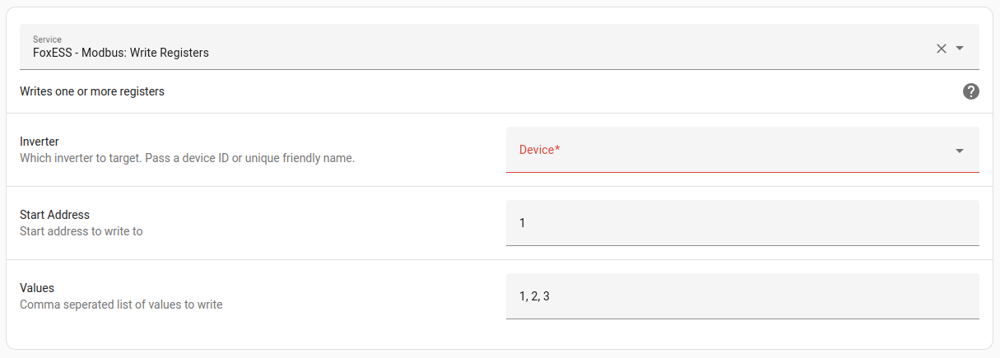
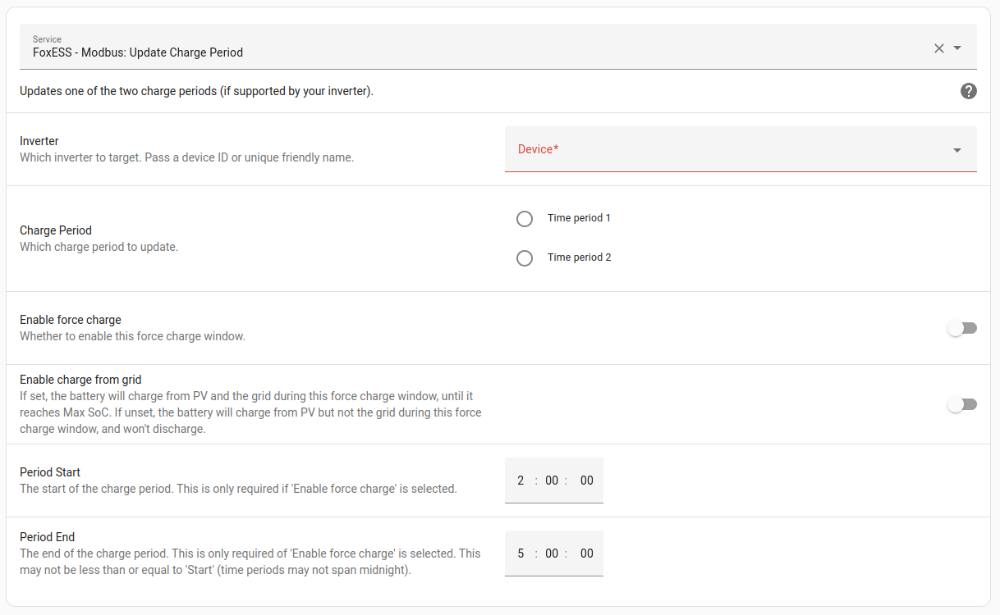

# Felicity Solar Inverter - Modbus

[![GitHub Release][releases-shield]][releases]
[![BuyMeCoffee][buymecoffeebadge]][buymecoffee]
[![Community Forum][forum-shield]][forum]

\*\* **This project is not endorsed by, directly affiliated with, maintained, authorized, or sponsored by Felicity Solar** \*\*

## Introduction

A Home Assistant custom component which communicates with Felicity Solar T-REX and IGVM inverters and derivatives without using FSolar cloud.

This means that you're not reliant on FSolar cloud infrastructure, so HA keeps working when the cloud goes down.
You can also read solar production etc in every 10 seconds, rather than once every 5 minutes.

Depending on your inverter model, you can also set charge periods, work mode, min/max SoC.
See [Supported Features](https://github.com/comcowo/fsolar_modbus/wiki/Supported-Features).

Supported models:

- Felicity Solar Inverter T-REX

You will need a direct connection to your inverter.
In most cases, this means buying a modbus to ethernet/USB adapter and wiring this to a port on your inverter.
See the documentation for details.

**[See the wiki](https://github.com/comcowo/fsolar_modbus/wiki) for how-to articles and FAQs.**

## Installation

[][my-hacs]

Recommended installation is through [HACS][hacs]:

1. Either [use this link][my-hacs], or navigate to HACS integration and:
   - 'Explore & Download Repositories'
   - Search for 'Felicity Solar Inverter - Modbus'
   - Download
2. Restart Home Assistant
3. Go to Settings > Devices and Services > Add Integration
4. Search for and select 'Felicity Solar Inverter - Modbus' (If the integration is not found, empty your browser cache and reload the page)
5. Proceed with the configuration

## Usage

1. Navigate to Settings -> Devices & Services to find:

2. Select '1 device' to find all Modbus readings:

## Charge Periods

If your inverter supports setting charge periods, you can use install the [Charge Periods lovelace card](https://github.com/comcowo/fsolar_modbus_charge_period_card):

## Services

### Write Service

A service to write any modbus address is available, similar to the native Home Assistant service. To use a service, navigate to Developer Tools -> Services and select it from the drop-down.

### Update Charge Periods

Updates one of the two charge periods (if supported by your inverter).

### Update All Charge Periods

Sets all charge periods in one service call. The service "Update Charge Period" is easier for end-users to use.

---

[buymecoffee]: https://www.buymeacoffee.com/comcowo
[buymecoffeebadge]: https://img.shields.io/badge/buy%20me%20a%20coffee-donate-yellow.svg?style=for-the-badge
[hacs]: https://hacs.xyz
[my-hacs]: https://my.home-assistant.io/redirect/hacs_repository/?owner=comcowo&repository=fsolar_modbus&category=integration
[forum-shield]: https://img.shields.io/badge/community-forum-brightgreen.svg?style=for-the-badge
[forum]: https://community.home-assistant.io/
[releases-shield]: https://img.shields.io/github/release/comcowo/fsolar_modbus.svg?style=for-the-badge
[releases]: https://github.com/comcowo/fsolar_modbus/releases
